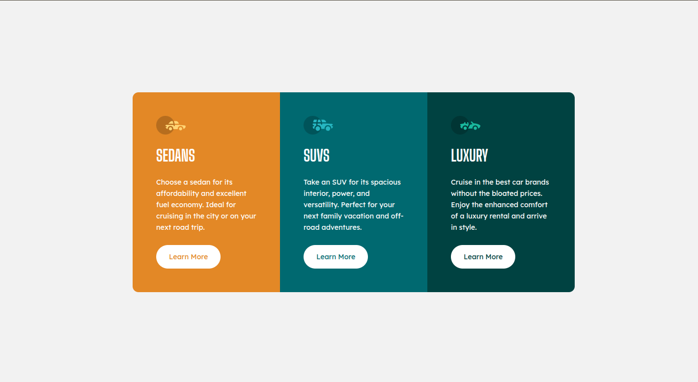
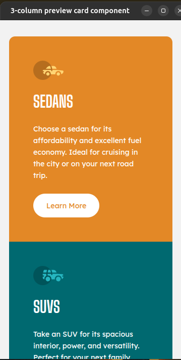

# Frontend Mentor - 3-column preview card component solution

This is my solution to the [3-column preview card component challenge](https://www.frontendmentor.io/challenges/3column-preview-card-component-pH92eAR2-) on Frontend Mentor.  
Frontend Mentor challenges help you improve your coding skills by building realistic projects.

---

## 📸 Screenshots

### Desktop Design


### Mobile Design


---

## 🔗 Links

- Solution URL: [GitHub Repo](https://github.com/muthu404200/3-column-card-css)
- Live Site URL: [Live Demo](https://muthu404200.github.io/3-column-card-css/)

---

## 💻 Built With

- Semantic **HTML5** markup  
- **CSS3** custom properties  
- **CSS Grid** for layout  
- **Flexbox** for alignment  
- Responsive design with **media queries**  
- Google Fonts (**Big Shoulders Display** & **Lexend Deca**)  

---

## 🚀 Features

- Responsive layout for both desktop and mobile  
- Hover states for interactive elements (buttons)  
- Consistent design using CSS variables  
- Clean and accessible semantic structure  

---

## 📚 What I Learned

While building this project, I practiced:

- Combining **Grid** (for main layout) and **Flexbox** (for content alignment).  
- Using `:root` variables for consistent theming.  
- Creating simple hover states with smooth transitions.  
- Structuring a responsive component that adapts from 3-column desktop to stacked mobile view.  

Here’s a code snippet I’m proud of:

```css
button {
  padding: 0.8rem 1.5rem;
  border: 2px solid #fff;
  border-radius: 25px;
  background: #fff;
  cursor: pointer;
  transition: all 0.3s ease;
}

.box1 button { color: var(--Gold500); }
.box1 button:hover { background: transparent; color: #fff; }
